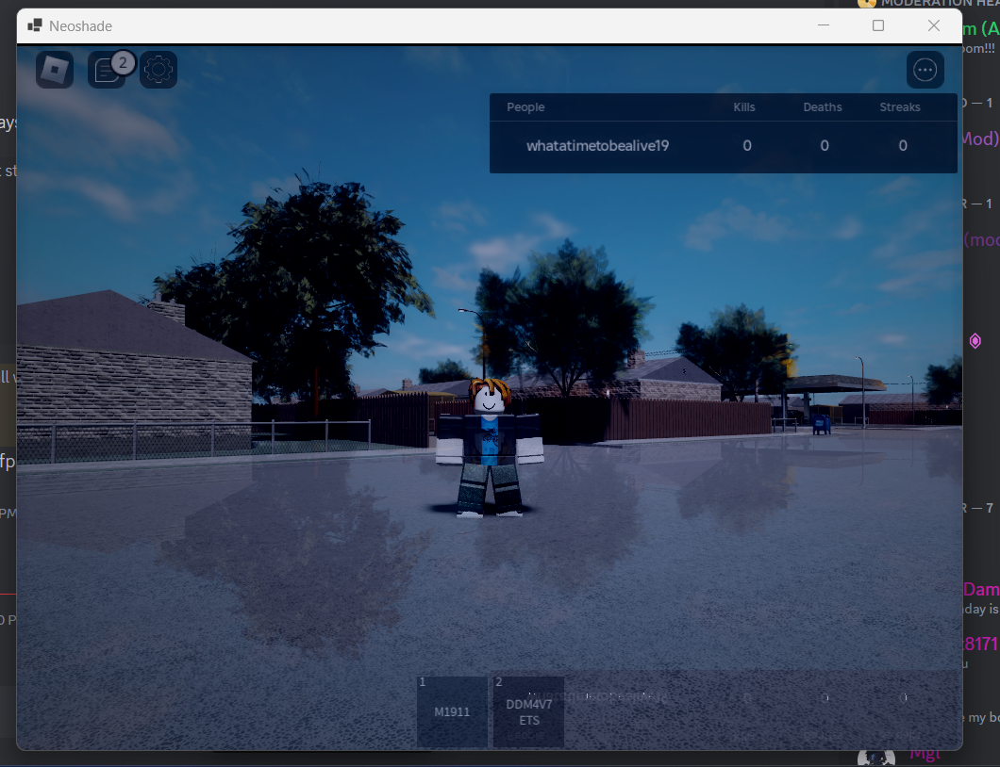

# Neoshade
Experimental Roblox Shader System

## Features
|Name|Status|Details|Fix|
|----|------|-------|---|
|Vignette|✅|With intensity option|N/A|
|Tint|✅|Changes general atmosphere color|N/A|
|Film Grain|✅|Reduces color banding, makes it look more authentic|N/A|
|SSR|⚠️|Can get messy depending on camera angle|Possible Fix: Estimate camera angle and distort the ssr based on that|
|Motion Blur|⚠️|Effect is always applied so intensity had to be reduces|Possible Fix: Try to find out what is distance between two pixels and apply motion blur based on direction of difference|
|Depth Buffer Sharing|❌|Not done yet|N/A|
|SSGI|❌|Not done yet|N/A|

## Effects
|Name|Status|Details|
|----|------|-------|
|Comic Book|⚠️|Still work in progress|

## Instructions
- Restore the project `dotnet restore`
- Compile source code using `dotnet publish`
- Copy shaders directory to bin/Release/net8.0-windows
- Start Roblox
- Run Neoshade
- Neoshade will hook itself to Roblox
- To close Neoshade you should close the command prompt comes with it
- If you switch to another application and Roblox is not under the Neoshade then your clicks will pass through it to fix te problem you should click Roblox in task bar if that happens!

## Disclaimer
Very early in development progress. 
You cannot run this in full screen.
Resizing Roblox don't work yet.

Currently tested in:
- Nvidia GTX 1050 Ti Mobile Edition
- Intel XE 80EU

May or not work in AMD, we don't know that

No binary builds due to my reputation being horrible, if you are technical enough read the source code line by line and carefully compile then run it in a VM with a gpu.

